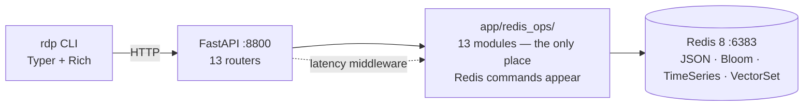
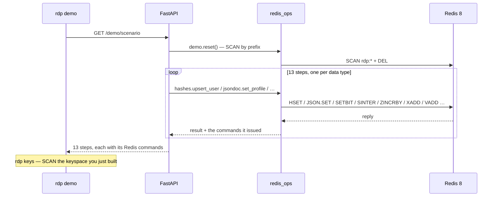

# Redis Data Types Playground

Every Redis data type, one real use case each, behind a FastAPI endpoint and a CLI.

The question this project answers is not "how do I call `ZADD`" — it is **"given a problem,
which Redis data type is the right model, and why not the other one?"** Every module in
`app/redis_ops/` opens with that argument written out.

```bash
docker compose up -d redis
uv venv && source .venv/bin/activate && uv pip install -e ".[dev]"
uv run uvicorn app.main:app --reload --port 8800
uv run rdp demo
```

| Service | URL |
|---|---|
| API + OpenAPI docs | http://localhost:8800/docs |
| Redis | `localhost:6383` |

---

## Architecture



Two layers, not three. There is no `services/` package: with no business rules to hold, every
service would be a one-line passthrough. Routers parse and serialise; `redis_ops` holds all the
Redis knowledge. **No Redis command appears outside `app/redis_ops/`.**

### The demo scenario, end to end



---

## Running it

```bash
docker compose up -d redis          # Redis 8 on :6383
uv venv && source .venv/bin/activate && uv pip install -e ".[dev]"
uv run uvicorn app.main:app --reload --port 8800
```

Everything containerised instead:

```bash
docker compose --profile api up --build
```

Quality gate:

```bash
uv run ruff format . && uv run ruff check --fix . && uv run mypy app cli && uv run pytest -q
```

Tests run against a **real Redis on db 15**, flushed per test. `fakeredis` cannot emulate JSON,
Bloom, Time Series or vector sets, and mocking the client would test nothing worth testing.

---

## The CLI

Five commands. It deliberately does *not* mirror the 40 HTTP endpoints.

```bash
uv run rdp demo               # the 13-step story, with the Redis commands behind each step
uv run rdp demo --type sets   # just one data type
uv run rdp keys               # the keyspace you built, grouped by Redis type, with sizes
uv run rdp types              # the decision matrix below, as a table
uv run rdp health             # API + which modules are loaded
uv run rdp reset              # delete every rdp:* key
```

`RDP_API_URL` (default `http://localhost:8800`) points it elsewhere.

---

## Decision matrix

Also at `GET /demo/types` and `rdp types`. The last column is the part the Redis docs will not
tell you: the plausible-looking wrong choice.

| I need to… | Use | Because | Common mistake |
|---|---|---|---|
| Store a single value, or one that expires | **String** | One key, one value, one TTL; `INCR` is atomic | A Hash with one field — you cannot expire a field as easily as a key |
| Store a flat object with independent fields | **Hash** | `HSET`/`HINCRBY` touch one field atomically | JSON in a String — every update is a read-modify-write race |
| Store a nested document, or arrays in it | **JSON** | JSONPath reads/writes one leaf | A Hash with dotted field names, re-inventing paths by hand |
| Keep an ordered queue or capped feed | **List** | O(1) at both ends; `LPUSH`+`LTRIM` caps it | A Sorted Set scored by timestamp you never query by |
| Keep a unique collection, test membership | **Set** | O(1) `SISMEMBER`; `SINTER`/`SDIFF` run server-side | A List — membership is O(N) and duplicates corrupt counts |
| Rank by score | **Sorted Set** | Ordering maintained on write; top-N never sorts | A Hash of user→points plus a client-side sort |
| Track booleans for millions of entities | **Bitmap** | 1 bit each — 1M users = 125 KB/day; `BITOP` does the algebra | A Set of ids per day: correct, ~50× the memory |
| Pack several small integers per record | **Bitfield** | level+streak+xp in 4 bytes, explicit overflow policy | Using it before memory is measurably the problem |
| Ask "what is near this point?" | **Geospatial** | Geohash scores make radius search a range scan | Lat/lon in a Hash + haversine in the application |
| Keep an event log many consumers read | **Stream** | Entries persist after reading; groups add acks and replay | A List you `RPOP` — destructive, single consumer, no history |
| Store timestamped measurements | **Time Series** | Compression, retention and aggregation built in | A Sorted Set scored by timestamp — no retention, no aggregation |
| Ask "have I definitely never seen this?" | **Bloom Filter** | No false negatives, so "no" is a guarantee | An exact Set of everything ever seen, growing forever |
| Count distinct at huge cardinality | **HyperLogLog** | 12 KB flat, ~0.81% error, `PFMERGE` unions periods | Summing daily unique counts — double-counts returners |
| Ask "how often did *this* happen?" | **Count-Min Sketch** | Fixed memory; over-counts on collision, never under-counts | A Hash keyed by user text — unbounded cardinality |
| Ask "which are the biggest?" | **Top-K** | Bounded memory, and unlike a CMS it can enumerate | A Sorted Set with one member per distinct term |
| Ask "what is similar to this?" | **Vector Set** | HNSW ranks by distance instead of filtering | Set intersection on tags — exact, and blind to near matches |

---

## The 13 data types

Each heading links to the module, whose docstring carries the full argument. The endpoints are
grouped by type in the OpenAPI page, in this order.

### 1. Strings — [`app/redis_ops/strings.py`](app/redis_ops/strings.py)
**What** One key, one binary-safe value; numeric values get atomic integer ops.
**Problem** A session that must expire on its own, and a counter many requests increment at once.
**Commands** `SET … EX` · `GET` · `MGET` · `INCRBY` · `TTL` · `DEL`
**Here** `POST /strings/sessions` issues a token with a TTL; `POST /strings/views/{id}` counts views.
**Not a Hash** You cannot expire one hash *field* as simply as you expire a key.
**Limits** No partial updates. Packing `"name|email|age"` into one string means you wanted a Hash.

### 2. Hashes — [`app/redis_ops/hashes.py`](app/redis_ops/hashes.py)
**What** Field → value under one key. Redis's "object".
**Problem** A user record whose karma changes without rewriting the name.
**Commands** `HSET` · `HGETALL` · `HMGET` · `HEXISTS` · `HINCRBY` · `HDEL`
**Here** `POST /hashes/users`, `PATCH /hashes/users/{id}/karma`.
**Not JSON** This record is flat; paths and nesting buy nothing. **Not a String of JSON** — that
makes every field update a read-modify-write race.
**Limits** Flat strings only. `HGETALL` on a huge hash is O(N) and blocks; use `HSCAN`.

### 3. JSON (and arrays) — [`app/redis_ops/jsondoc.py`](app/redis_ops/jsondoc.py)
**What** A native JSON document addressed by JSONPath, stored parsed rather than as text.
**Problem** The same user, but with nested preferences, a devices list and an interests array.
**Commands** `JSON.SET` · `JSON.GET` · `JSON.ARRAPPEND` · `JSON.ARRLEN` · `JSON.NUMINCRBY`
**Here** `PUT /json/profiles/{id}`, and `POST …/interests` appends without a rewrite.
**Where arrays live** Redis has two array-shaped things and they are not competitors: a **List**
is a standalone ordered collection with its own lifecycle (a queue); a **JSON array** is part of
a document. `user.interests` is a JSON array; "pending notifications" is a List.
**Not a Hash** A Hash cannot nest — you would end up with `devices.0`, `devices.1` by hand.
**Limits** Larger than a Hash for flat data. `$.a` returns `[value]`, not `value`.

### 4. Lists — [`app/redis_ops/lists.py`](app/redis_ops/lists.py)
**What** A quicklist: O(1) push/pop at both ends, O(N) in the middle.
**Problem** A notification inbox: newest first, capped at 100, consumed oldest-first.
**Commands** `LPUSH` · `RPOP` · `LRANGE` · `LTRIM` · `LLEN`
**Here** `LPUSH`+`LTRIM` caps the feed; `LPUSH`+`RPOP` makes it FIFO.
**Not a Stream** Popping is destructive — one consumer, no history, no replay. Right for an
inbox, wrong for an event log.
**Limits** No random access, no per-item TTL, no retries or dead-lettering.

### 5. Sets — [`app/redis_ops/sets.py`](app/redis_ops/sets.py)
**What** Unordered unique strings; O(1) membership.
**Problem** The follow graph. Following twice must be a no-op.
**Commands** `SADD` · `SREM` · `SISMEMBER` · `SMEMBERS` · `SCARD` · `SINTER` · `SDIFF`
**Here** `GET /sets/mutual` is `SINTER` — "who do you both follow", computed in Redis, one round
trip, instead of two lists over the wire and an intersection in Python.
**Not a Sorted Set** Only if you need order or a score; a Set is cheaper.
**Limits** `SMEMBERS` order is an implementation detail — never rely on it. O(N) on big sets.

### 6. Sorted Sets — [`app/redis_ops/sortedsets.py`](app/redis_ops/sortedsets.py)
**What** A Set where each member has a float score and Redis keeps members ordered by it.
**Problem** A leaderboard, plus "what rank am I?".
**Commands** `ZINCRBY` · `ZADD` · `ZREVRANGE … WITHSCORES` · `ZREVRANK` · `ZSCORE` · `ZCARD`
**Here** `ZINCRBY` awards points atomically; ordering is maintained on **write**, so top-10 over
ten million players is microseconds and nothing is sorted at read time.
**Not a Hash of points** "Top 10" would mean `HGETALL` plus a client-side sort of everyone, and
"what rank is X?" becomes unanswerable without a full scan.
**Limits** Scores are doubles — beyond 2^53 integers lose precision. Ties break lexicographically.

### 7. Bitmaps — [`app/redis_ops/bitmaps.py`](app/redis_ops/bitmaps.py)
**What** Bit-level operations on a String: bit *N* is user *N*'s flag.
**Problem** Daily active users, and day-over-day retention.
**Commands** `SETBIT` · `GETBIT` · `BITCOUNT` · `BITOP` · `STRLEN`
**Here** One key per day. 1M users = 125 KB/day; a year is ~45 MB. `GET /bitmaps/retention` is
`BITOP AND` + `BITCOUNT` — no user ids cross the network.
**Not a HyperLogLog** An HLL also counts uniques in 12 KB, but *approximately*, and it can never
answer "was user 42 active?". Bitmaps are exact and queryable per member.
**Limits** Needs **small dense integer ids** — id 9,000,000,000 alone allocates a 1 GB string.
This project assigns dense offsets via a Redis hash, which is itself the lesson.

### 8. Bitfields — [`app/redis_ops/bitfields.py`](app/redis_ops/bitfields.py)
**What** A String treated as an array of arbitrary-width integers.
**Problem** Level (u8), streak (u8), xp (u16) — three small numbers always read together.
**Commands** `BITFIELD … SET/GET/INCRBY` · `OVERFLOW SAT|WRAP|FAIL`
**Here** 4 bytes per user versus ~100 for the equivalent Hash. `GET /bitfields/layout` documents
the packing, because nothing else can.
**The interesting part** The default overflow policy is **WRAP**: 65,530 xp + 100 becomes 64.
`OVERFLOW SAT` clamps instead. Choosing deliberately is the whole skill.
**Limits** Zero self-description. Change the layout and every stored record silently becomes
garbage, with no migration path but a rewrite.

### 9. Geospatial — [`app/redis_ops/geo.py`](app/redis_ops/geo.py)
**What** Not a separate type: a Sorted Set whose scores are 52-bit geohashes.
**Problem** "Users within 5 km, nearest first, with distances."
**Commands** `GEOADD` · `GEOPOS` · `GEODIST` · `GEOSEARCH … BYRADIUS … WITHDIST`
**Why it works** Geohashes interleave lat/lon bits, so nearby points have nearby scores and a
radius search becomes a few range scans.
**Not a Hash of coordinates** Every query would load every user and compute haversine in the app.
**Limits** Points only — no polygons, no joins. Latitude is capped at ±85.05°.
**Gotcha** `GEOADD` takes **(longitude, latitude)** — the reverse of how people say it.

### 10. Streams — [`app/redis_ops/streams.py`](app/redis_ops/streams.py)
**What** An append-only log of `<ms>-<seq>` entries holding field/value maps.
**Problem** Every meaningful event, appended once and read by anyone, now or later or twice.
**Commands** `XADD … MAXLEN ~` · `XREVRANGE` · `XGROUP CREATE … MKSTREAM` · `XREADGROUP` ·
`XACK` · `XPENDING`
**Here** `POST /streams/events/consume` does the full group cycle in one request — no daemon
needed to see how it works. Entries **stay** in the stream after consumption.
**Not Pub/Sub** Pub/Sub is fire-and-forget: an offline subscriber misses the message entirely.
**Limits** Grows unless trimmed. It is a log, not a broker — no routing, no rebalancing.

### 11. Probabilistic — [`app/redis_ops/probabilistic.py`](app/redis_ops/probabilistic.py)
Four structures answering four *different* questions. `POST /probabilistic/search` feeds one
event into three of them at once, and `GET /probabilistic/search/stats` returns all three
answers side by side — the contrast is the lesson.

| Structure | Question | Guarantee | Commands |
|---|---|---|---|
| **Bloom filter** | "Definitely never seen?" | No false negatives; false positives possible | `BF.ADD`, `BF.EXISTS` |
| **HyperLogLog** | "How many distinct?" | ~0.81% error in a flat 12 KB | `PFADD`, `PFCOUNT`, `PFMERGE` |
| **Count-Min Sketch** | "How often *this* one?" | Over-counts, never under-counts | `CMS.INITBYPROB`, `CMS.INCRBY`, `CMS.QUERY` |
| **Top-K** | "Which are the biggest?" | Bounded memory; *can* enumerate | `TOPK.RESERVE`, `TOPK.ADD`, `TOPK.LIST` |

**Why keep both CMS and Top-K?** A CMS cannot list its own contents — you must already know the
term to ask about it. Top-K enumerates but only tracks the heavy hitters. They complement.
**Use a Bloom filter as a gate**, not an answer: "definitely new" skips an expensive exact
lookup entirely; "probably seen" falls through to the database.
**Limits** Never use them for billing, quotas or anything auditable. Sizing is fixed up front.

### 12. Time Series — [`app/redis_ops/timeseries.py`](app/redis_ops/timeseries.py)
**What** Compressed `(timestamp, double)` pairs with retention, labels and aggregation.
**Problem** API latency. A middleware records **every** request, so `GET
/timeseries/http-latency` returns real data with nothing seeded.
**Commands** `TS.CREATE … RETENTION … DUPLICATE_POLICY … LABELS` · `TS.ADD` ·
`TS.RANGE … AGGREGATION avg` · `TS.MRANGE … FILTER`
**Not a Sorted Set scored by timestamp** That gives you ordering and range queries, and nothing
else: no compression, no automatic retention, and aggregation means shipping every raw sample to
your app to average it.
**Not a Stream** Streams retain history but store maps, not numbers, and cannot aggregate.
Streams answer "what happened"; Time Series answers "what was the number".
**Limits** Doubles only; labels are per-series, not per-sample. Not Prometheus at scale.

### 13. Vector Sets — [`app/redis_ops/vectors.py`](app/redis_ops/vectors.py)
**What** Redis 8's built-in HNSW vector index (a `MODULE LIST` entry with no `.so` path).
**Problem** "Show me users like this one" — ranked by degree of similarity, not filtered.
**Commands** `VADD … VALUES` · `VSIM … ELE|VALUES … WITHSCORES` · `VCARD` · `VDIM`
**Embeddings here** No ML model: each interest tag is feature-hashed onto one of 32 dimensions
and the result is normalised, so cosine similarity tracks tag overlap directly (2-of-3 shared
tags ≈ 0.83, nothing shared ≈ 0.5 — see the score gotcha below). Same *shape* as real
embeddings; swap `embed()` for a sentence-transformer and the Redis calls do not change.
**Not Set intersection on tags** That is exact and boolean — it ranks nothing and finds nothing
for `{postgres}` vs `{databases}`. Similarity is a distance, not a filter.
**Limits** Approximate recall by design. Quality is entirely the quality of your embeddings.

---

## Key patterns

Every pattern is a function in [`app/core/keys.py`](app/core/keys.py) — the convention is
executable rather than documentation that drifts. Everything starts with `rdp:`, which is what
lets `POST /demo/reset` clean up by `SCAN` without touching anything else in the database.

| Pattern | Redis type | Written by |
|---|---|---|
| `rdp:session:{user_id}` (+ `:last_seen`) | string (TTL) | Strings |
| `rdp:post:{post_id}:views` | string (counter) | Strings |
| `rdp:user:{user_id}` | hash | Hashes |
| `rdp:profile:{user_id}` | ReJSON-RL | JSON |
| `rdp:notifications:{user_id}` | list | Lists |
| `rdp:following:{user_id}` · `rdp:followers:{user_id}` | set | Sets |
| `rdp:leaderboard:global` | zset | Sorted Sets |
| `rdp:activity:{iso-date}` | string (bitmap) | Bitmaps |
| `rdp:bitindex` · `rdp:bitindex:seq` | hash · string | Bitmaps (id → offset) |
| `rdp:state:{user_id}` | string (bitfield) | Bitfields |
| `rdp:geo:users` | zset (geohash) | Geospatial |
| `rdp:stream:events` | stream | Streams |
| `rdp:bloom:emails` | MBbloom-- | Bloom |
| `rdp:hll:visitors:{iso-date}` | string (HLL) | HyperLogLog |
| `rdp:cms:searches` · `rdp:topk:searches` | CMSk-TYPE · TopK-TYPE | CMS / Top-K |
| `rdp:metric:{name}` | TSDB-TYPE | Time Series |
| `rdp:vectors:users` | vectorset | Vector Sets |

Run `uv run rdp keys` after `rdp demo` to see them all with their real types and sizes.

---

## Gotchas

Things that cost time if you have not met them before.

- **`redis:7-alpine` has none of the modules.** Redis 8 bundles JSON, Bloom/CMS/Top-K, Time
  Series, Search *and* vector sets in the official image — no `redis-stack` needed. The app
  refuses to start if a module is missing, rather than failing later with "unknown command".
- **`BF.ADD` auto-creates a filter; `CMS.INCRBY` and `TOPK.ADD` do not.** Unreserved sketches
  error on every call. They are reserved at startup in `app/core/client.py:bootstrap`.
- **`TS.ADD` auto-creates too — but with no retention, no labels and no duplicate policy**, so
  the series grows forever and `TS.MRANGE` cannot find it. Always `TS.CREATE` first.
- **Two samples in the same millisecond raise** `TSDB: Error at upsert` unless the series was
  created with `DUPLICATE_POLICY`. Under any real request rate this happens immediately.
- **`BITFIELD INCRBY` defaults to `WRAP`.** A player at 65,530 xp who earns 100 ends up at 64
  unless you say `OVERFLOW SAT`.
- **With `decode_responses=True`, `JSON.GET` returns a JSON *string*** — `json.loads` it. And a
  `$`-rooted path returns an array of matches, so `$.theme` gives `["dark"]`, not `"dark"`.
- **`XGROUP CREATE` raises `BUSYGROUP` on a re-run.** That error means the group already exists,
  which is success.
- **`GEOADD` takes (longitude, latitude)**, the reverse of how everyone says it out loud.
- **`VSIM … ELE x` returns `x` itself first** with a perfect score. Ask for k+1 and drop it.
- **VSIM scores are `(1 + cosine) / 2`, so 0.5 means *orthogonal* — no relationship at all**,
  not "half similar". A user sharing zero tags scores 0.5, not 0.
- **redis-py applies response callbacks even through `execute_command`**, so some module
  replies do not arrive in the shape the protocol documents:
  `VSIM … WITHSCORES` → `{member: score}` dict (not a flat list), `TS.MRANGE` →
  `{key: [labels, aggregators, samples]}` dict, `JSON.NUMINCRBY` → an already-parsed list
  (while `JSON.GET` still hands you a raw string). This project parses both shapes.
- **The module name in `MODULE LIST` is `rejson`, not `json`.** A startup check that greps for
  "json" silently never fires — which is how you get a check that checks nothing.
- **Deleting keys by prefix can break the sketches.** `rdp:cms:*` and `rdp:topk:*` sit under the
  same prefix as everything else, so a naive reset leaves every later `CMS.INCRBY` failing.
  `POST /demo/reset` re-reserves them; a reset must restore an empty *usable* state.
- **Feature-hashed embeddings need enough dimensions to be sparse.** An early version of
  `embed()` spread each tag across all 8 components: it ranked correctly but every pair scored
  ~0.79, with the related pair beating the unrelated one by 0.002. One tag → one dimension over
  32 dims gives 0.83 vs 0.50 instead. Sparsity is what makes similarity legible.
- **Bitmaps need dense integer ids.** A sparse id allocates a string as large as the id.
- **`SCAN`, never `KEYS`** — `KEYS` walks the entire keyspace while blocking the server.

---

## Layout

```text
app/
├── main.py            # app, lifespan, module check, latency middleware
├── demo.py            # the 13-step scenario (GET /demo/scenario and `rdp demo`)
├── reference.py       # the decision matrix (GET /demo/types and `rdp types`)
├── core/              # config, client + bootstrap, keys, logging
├── models/            # Pydantic v2 request models, by domain
├── redis_ops/         # 13 modules — every Redis command in the project lives here
└── api/routes/        # 13 routers + meta (health, demo, keys, types)
cli/main.py            # Typer + Rich, talks to the API over HTTP
tests/                 # 13 type test modules + API smoke tests, against real Redis db 15
```

## Configuration

Copy `.env.example` to `.env`. `REDIS_HOST`, `REDIS_PORT`, `REDIS_DB`, `REDIS_PASSWORD`,
`APP_ENV`, `KEY_PREFIX`, and `RDP_API_URL` for the CLI. `.env` is gitignored; only
`.env.example` is committed, with placeholders.
